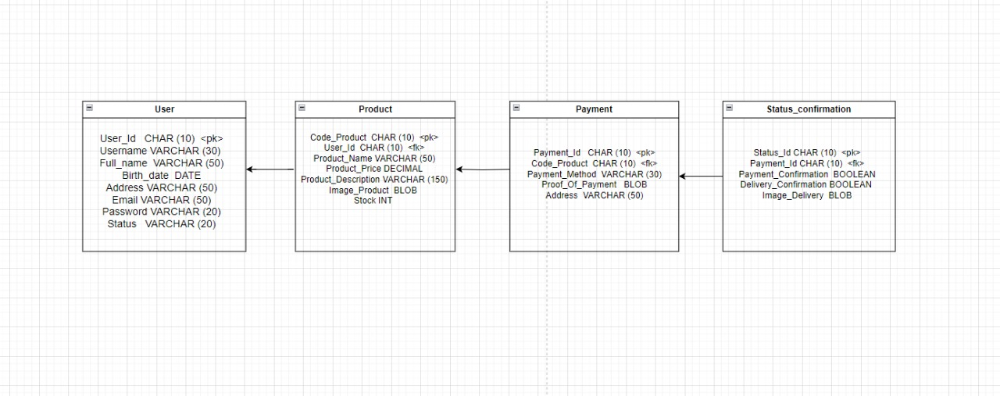

# Database Structure

On this page we provide the lists of tables used to store the application data.

## Physical Data Model
                                                                                                                              

## Data Description
User adalah tabel yang digunakan oleh penjual dan pembeli untuk melakukan registrasi dimana proses register berisi user_id,username,full_name,Birth_date
address,Email,password, dan Status. di dalam attribut status lah diketahui apakah usernya penjual ataupun pembeli.

Product adalah tabel yang berisi data-data produk yang akan di jual dan si penjual dapat mengcreate serta mengakses produk, sedangkan si pembeli hanya dapat mengakses produk.Produk juga dapat di akses jika sudah terdapat user_id di dalam tabel produk (user melakukan register).

payment adalah tabel yang  berisi tahap pembayaran yang berisikan kode produk sesuai dengan item produk apa yang ingin di beli oleh si pembeli. payment berisi payment_id,payment_methode(metode pembayaran),proof_of_payment(bukti pembayaran), dan address(alamat pembeli).

Status_confirmation adalah tabel yang merupakan lanjutan dari payment, tabel ini berhubungan dengan payment yang berisi payment_id. Status_Confirmation berisi Status_id,payment_confirmation,delivery_confirmation, dan Image_delivery.

## Related

+ [Table of Content](README.md).
+ [Software Requirements](Software-Requirements.md).
+ [Installation](Installation.md).
+ [Features](Features.md)
+ [Database Structure](Database-Structure.md)